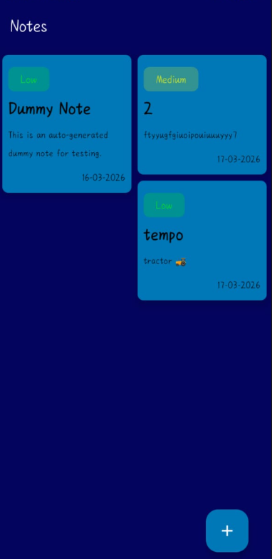
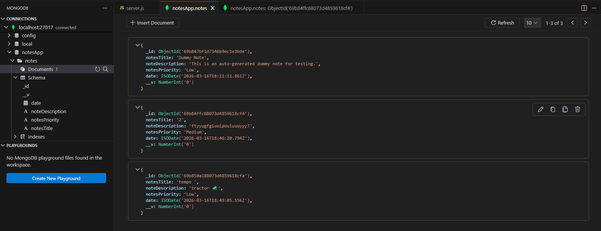

# 📝 Notes App — ExpressJS & Mongoose Backend

A RESTful backend server for a Notes application built with **Node.js**, **ExpressJS**, and **Mongoose**, connected to a local **MongoDB** database.



---

## 🛠️ Tech Stack

| Technology | Purpose |
|---|---|
| Node.js | Runtime environment |
| Express.js | Web framework & API routing |
| Mongoose | MongoDB object modeling (ODM) |
| MongoDB | NoSQL database |
| Nodemon | Auto-restart on file changes |

---

## 🗄️ Database



This project uses **MongoDB** running locally. Mongoose handles schema definition, validation, and all database interactions.

---

## ✅ Prerequisites

Ensure the following are installed on your system:

- **[Node.js](https://nodejs.org/)** (LTS version recommended)
- **[MongoDB Community Server](https://www.mongodb.com/try/download/community)** (must be running)
- **[MongoDB Compass](https://www.mongodb.com/try/download/compass)** *(optional — GUI to view your data)*
- **VS Code** or any code editor

---

## 🚀 Installation & Setup

### 1. Clone the Repository

```sh
git clone https://github.com/Shayar-Gupta/NotesAppWithNodeJS.git
cd NotesAppWithNodeJS
```

### 2. Install Dependencies

```sh
npm install
```

Or install packages individually:

```sh
npm i express
npm i mongoose
npm i nodemon
```

### 3. Create the Server File

Create a file named `server.js` in the root directory and add your backend logic.

> 📄 Reference: [serverFile.txt](serverFile.txt) — rename this to `server.js`

### 4. Start the Server

```sh
npx nodemon server.js
```

You should see:
```
🚀 Server running at http://localhost:3000
```

---

## 📡 API Endpoints

| Method | Endpoint | Description |
|---|---|---|
| `GET` | `/` | Health check — returns Hello World |
| `GET` | `/notes` | Fetch all notes |
| `POST` | `/save-notes` | Save a new note |
| `GET` | `/save-dummy-note` | Save a test note (for development) |

### Example Request Body for `POST /save-notes`

```json
{
  "notesTitle": "My First Note",
  "noteDescription": "This is the note content.",
  "notesPriority": "High"
}
```

---

## 🗃️ Data Schema

```js
{
  notesTitle:      String  (required),
  noteDescription: String  (required),
  notesPriority:   String  (required),  // "Low" | "Medium" | "High"
  date:            Date    (default: now)
}
```

---

## ⚙️ Troubleshooting

### MongoDB not connecting?

1. Press `Win + R` → type `services.msc` → press Enter
2. Search for **MongoDB** in the list
3. Right-click → **Start** (or **Restart** if already running)

Or run in PowerShell (as Administrator):
```sh
net start MongoDB
```

### `npm` not recognized in PowerShell?

Run this once in PowerShell as Administrator:
```sh
Set-ExecutionPolicy -Scope CurrentUser -ExecutionPolicy RemoteSigned
```

### Android app can't connect to server?

Replace `localhost` with your PC's local IP address in your Android project:
```
http://192.168.x.x:3000
```
Find your IP by running `ipconfig` in PowerShell and looking for **IPv4 Address**.

---

## 📁 Project Structure

```
NotesAppWithNodeJS/
├── server.js          # Main server file
├── package.json       # Project dependencies
├── assets/
│   ├── image.png      # App screenshot
│   └── mongoDB.jpg    # MongoDB logo/screenshot
└── README.md
```

---

## 📄 License

This project is open source and available under the [MIT License](LICENSE).
